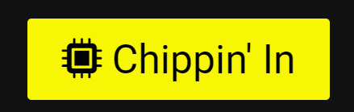
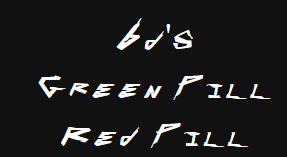

# Samurai - chrome rock band

## Site overview

Chrome rock band is a website that treats Samurai band as real, separate entity from Cyberpunk 2077. The game itself is set in a dystopian world, ruled by large corporations and full of social inequalities. 
The music in the game was performed by real musicians from Refused, and Johnny Silverhand's appearance was modeled after popular actor Keanu Reeves. He is also Johnny's voice in the game.
Judging from the monthly Spotify listeners and the views of each song on Youtube, there is a strong incentive to create a website that features Refused alter ego in-game, as many fans of the game seem to have liked this kind of musicians incarnation. This website aims to fulfill, to some extent, this purpose while remaining faithful to the source material. The project was built to answer following, potential users needs:

* Can i check the band's new releases ??
* When i can hear them live ? 
* Can I listen to their music for free?
* Is there any band's merchandise that i can buy ?
* What instruments are they playing on ?
* How i can contact them ? 

While some of these needs are beyond the scope of this project, the author of this website has endeavored to answer all of these questions by making the most of his newly acquired skills.

As a side note: although this site contains slang elements, it generally avoids the use of swearing, with one exception (it was censored during the development process)

https://www.youtube.com/watch?v=m1kYOo9UxBw

Material above served as promotional material during E3 event. This is an iconic and well-known quote that it would be a huge oversight not to include it in the project.


## Table of contents:

1. [Site overview](#site-overview)
1. [Features](#features)
    * [Site wide](#site-wide)
        * [Favicon](#favicon)
        * [Responsive navigation bar](#responsive-navigation-bar)
            * [Hover indicator](#hover-indicator)
            * [Active page indicator](#active-page-indicator)
        * [Footer](#footer)
        * [Return to top button: mobile](#return-to-top-button-mobile)
        * [Error 404 page](#error-404-page)
    * [Landing page](#landing-page)
        * [Hero image](#hero-image)
        * [Main button](#main-button)
            * [Main button: hover effect](#main-button-hover-effect)
        * [Social media buttons](#social-media-buttons)
            * [Social media buttons: desktop view](#social-media-buttons-desktop-view)
            * [Social media buttons: mobile view](#social-media-buttons-mobile-view)
            * [Social media buttons: hover effect](#social-media-buttons-hover-effect)
    * [News page](#main-page-news-page)
        * [Newsman avatar](#newsman-avatar)
        * [News page: desktop view](#news-page-desktop-view)
        * [News page: mobile view](#news-page-mobile-view)
    * [Gigs page](#gigs-page)
        * [Poster](#poster)
    * [Dorphs page](#dorphs-page)
        * [Sub navigation menu: desktop view](#sub-navigation-menu-desktop-view)
        * [Sub navigation menu: mobile view](#sub-navigation-menu-mobile-view)
            * [Sub navigation menu: hover effect](#sub-navigation-menu-hover-effect)
        * [Youtube Player: dorphs page](#youtube-player-dorphs-page)
        * [Spotify Player](#spotify-player)
        * [Official Shop](#official-shop)
    * [Band page](#band-page)
        * [Band page: desktop view](#band-page-desktop-view)
        * [Band page: mobile view](#band-page-mobile-view)
            * [Info: hover effect](#info-hover-effect)
    * [Contact face page](#contact-face-page)
        * [Contact form](#contact-form)
    * [Contact form feedback page](#contact-form-feedback-page)
        * [Youtube Player: contact form feedback page](#youtube-player-contact-form-feedback-page)
    * [Existing Features](#existing-features)
    * [Features Left to Implement](#features-left-to-implement)
1. [Design](#design)
    * [Color scheme](#color-scheme)
    * [Wireframes](#wireframes)
      * [Landing page: desktop](#landing-page-desktop)
      * [Landing page: mobile](#landing-page-mobile)
      * [News page: dekstop](#news-page-dekstop)
      * [News page: mobile](#news-page-mobile)
      * [Gigs page: desktop](#gigs-page-desktop)
      * [Gigs page: mobile](#gigs-page-mobile)
      * [Dorphs page: desktop](#dorphs-page-desktop)
      * [Dorphs page: mobile](#dorphs-page-mobile)
      * [Band page: desktop](#band-page-desktop)
      * [Band page: mobile](#band-page-mobile)
      * [Contact page: desktop](#contact-page-desktop)
      * [Contact page: mobile](#contact-page-mobile)
      * [Contact feedback page: desktop](#contact-feedback-page-desktop)
      * [Contact feedback page: mobile](#contact-feedback-page-mobile)
      * [Error 404 page: desktop](#error-404-page-desktop)
      * [Error 404 page: mobile](#error-404-page-mobile)
1. [Technologies and Tools](#technologies-and-tools)
1. [Testing](#testing)
    * [Responsiveness](#responsiveness)
    * [Accessibility](#accessibility)
    * [Lighthouse Testing](#lighthouse-testing)
        * [Error 404: Lighthouse validation](#error-404-lighthouse-validation)
        * [Landing page: Lighthouse validation](#landing-page-lighthouse-validation)
        * [News page: Lighthouse validation](#news-page-lighthouse-validation)
        * [Gigs page: Lighthouse validation](#gigs-page-lighthouse-validation)
        * [Dorphs page: Lighthouse validation](#dorphs-page-lighthouse-validation)
        * [Band page: Lighthouse validation](#band-page-lighthouse-validation)
        * [Contact face page: Lighthouse validation](#contact-face-page-lighthouse-validation)
        * [Contact form feedback page: Lighthouse validation](#contact-form-feedback-page-lighthouse-validation)
    * [Functional Testing](#functional-testing)
        * [Navigation links](#navigation-links)
        * [Social media buttons: footer, landing page](#social-media-buttons-footer-landing-page)
            * [CDPR gear](#cdpr-gear)
        * [Error 404 page](#error-404-testing)
        * [Contact form](#contact-form-testing)
        * [Video/Music player](#videomusic-player-testing)
            * [Youtube player](#youtube-player-testing)
    * [Validator Testing](#validator-testing)
        * [W3C Markup Validation Service](#w3c-html-validation-service)
            * [Error 404 html validation](#error-404-html-validation)
            * [Landing page html validation](#landing-page-html-validation)
            * [News page html validation](#news-page-html-validation)
            * [Gigs page html validation](#gigs-page-html-validation)
            * [Dorphs page html validation](#dorphs-page-html-validation)
            * [Band page html validation](#band-page-html-validation)
            * [Contact face html validation](#contact-face-page-html-validation)
            * [Contact form feedback html validation](#contact-form-feedback-page-html-validation)
        * [W3C CSS Validation Service](#w3c-css-validation-service)
            * [Error 404 css validation](#error-404-css-validation)
            * [Landing page css validation](#landing-page-css-validation)
            * [News page css validation](#news-page-css-validation)
            * [Gigs page css validation](#gigs-page-css-validation)
            * [Dorphs page css validation](#dorphs-page-css-validation)
            * [Band page css validation](#band-page-css-validation)
            * [Contact face css validation](#contact-face-page-css-validation)
            * [Contact form feedback css validation](#contact-form-feedback-page-css-validation)
    * [Unfixed Bugs](#unfixed-bugs)
1. [Deployment](#deployment)
    * [Version control](#version-control)
    * [Deployment to github pages](#deployment-to-github-pages)
    * [Clone the repository locally](#clone-the-repository-locally)
    * [Pull requests](#pull-requests)
1. [Credits](#credits)
    * [Honorable mentions](#honorable-mentions)
    * [Content](#content)
    * [Media](#media)

## Features

### Site wide 

These features are common to all pages (besides landing page, that serves specific purpose in website structure) 

#### Favicon

 

Element that is present across all pages. Allows user to easily identify the page, if they have multiple open tabs

[Back to Table of contents](#table-of-contents)

#### Responsive navigation bar

* Contains the logo and links to News page, Gigs page, Dorphs page, Band page and Contact face page
    * The display of the navigation bar changes depending on screen size

* Navigation bar: Desktop view


* Navigation bar: Mobile view


[Back to Table of contents](#table-of-contents)

##### Active page indicator

* Serves as an additional visual indication of which page is currently displayed


[Back to Table of contents](#table-of-contents)

##### Hover indicator

* Informs the user that it is an interactive element


[Back to Table of contents](#table-of-contents)

#### Footer


* It serves as quick access to social media and informs that the website was created for educational purposes only
* A theme icon from font awesome is present as an additional form of indication and visual stimulation
* The hover effect, for each icon, informs the user that it is an interactive element. It is also related to a specific third-party service
* Due to the similarity of some colors, the buttons are placed in such a way that similar colors do not lie next to each other

[Back to Table of contents](#table-of-contents)

#### Return to top button: mobile

* It allows mobile users to quickly access the main navigation menu


[Back to Table of contents](#table-of-contents)

#### Content line separator

* The line separator is a visual representation of the structure of a website and allows the user to easily distinguish the beginning and end of content


[Back to Table of contents](#table-of-contents)

#### Error 404 page

* The 404 error page has been implemented to ensure that if one of the pages is mistyped, the user can easily return to any page


[Back to Table of contents](#table-of-contents)

### Landing page

#### Hero image

* It is the central point of landing page. Its purpose is to give a general idea that the website is about Samurai band. In addition, in the future it may serve as a link to a specific point of interest, defined by the site administrator (like concert, new single, special announcement).


[Back to Table of contents](#table-of-contents)

#### Main button 

* Serves as a link to the news page. As part of an intuitive design principle, it is larger than any other buttons, which suggests that it is more important than other buttons. The hover effect indicates that this is an active element
* A theme icon from font awesome is present as an additional form of indication and visual stimulation

[Back to Table of contents](#table-of-contents)


##### Main button: hover effect



[Back to Table of contents](#table-of-contents)

#### Social media buttons

* They serve as quick access to social media. Each button contains an additional text indicator, which give them a little spice
* Text is hidden on mobile devices by putting accessibility before fan service
* A theme icon from font awesome is present as an additional form of indication and visual stimulation
* The Hover effect, informs the user that it is an interactive element. It is also related to a specific third-party service
* Due to the similarity of some colors, the buttons are placed in such a way that similar colors do not lie next to each other

[Back to Table of contents](#table-of-contents)

##### Social media buttons: desktop view


[Back to Table of contents](#table-of-contents)

##### Social media buttons: mobile view


[Back to Table of contents](#table-of-contents)

#### Social media buttons: hover effect


[Back to Table of contents](#table-of-contents)

### Main page (News page)

* It is the main hub and the place where the user can find news related to the band's activities
* The avatar of Newsman / Administrator and its rank informs the user about the author of the post and is part of the planned account system in the future
    * As part of the responsive design, it changes its position to better suit mobile devices

[Back to Table of contents](#table-of-contents)

#### Newsman avatar 


[Back to Table of contents](#table-of-contents)

#### News page: desktop view


[Back to Table of contents](#table-of-contents)

#### News page: mobile view


[Back to Table of contents](#table-of-contents)

### Gigs page

* It tells the user when and where to see the band live and where to buy a ticket for an event the user may be interested in
* The poster serves as a visual representation of a specific event and as potential incentive, targeted towards the user

#### Poster


[Back to Table of contents](#table-of-contents)

### Dorphs page

* Sub navigation menu serves as a quick access to each section of the page 
* It is responsive to better suit mobile device users
* The hover effect, informs the user that it is an interactive element
* The Youtube player serves as a representation of the virtual reality concept, known as Braidances, in Cyberpunk lore
* Spotify player was chosen because of its popularity and user policy. It allows interested users to listen to free samples, and registered users can listen to whole tracks for free 
* Due to technological limitations, the user is directed to the external, official store for any band related merchandise

[Back to Table of contents](#table-of-contents)

#### Sub navigation menu: desktop view


[Back to Table of contents](#table-of-contents)

#### Sub navigation menu: mobile view 



[Back to Table of contents](#table-of-contents)

#### Sub navigation menu: hover effect 


[Back to Table of contents](#table-of-contents)

#### Youtube Player: dorphs page


[Back to Table of contents](#table-of-contents)

#### Spotify Player 


[Back to Table of contents](#table-of-contents)

#### Official Shop


[Back to Table of contents](#table-of-contents)

### Band page

* It contains basic information about each band member: name, surname, role and the instrument they are playing
* The brand of instruments is linked to each band member and emphasizes the character's personality
* The hover effect, informs the user that it is an interactive element

#### Band page: desktop view


[Back to Table of contents](#table-of-contents)

#### Band page: mobile view


[Back to Table of contents](#table-of-contents)

#### Info: hover effect


[Back to Table of contents](#table-of-contents)

### Contact face page

#### Contact form

* The image of the charismatic and jovial Johnny Silverhand invites users to fill out the contact form
* Contact form is stylized as page from a notepad
* The contact form consists of : 
    * Name (required)
    * Surname (required)
    * Email (requred)
    * Text area for opinions
* A theme icon from font awesome is present as an additional form of indication and visual stimulation
* Since there is no logic to process all the inputs, the contact form method is set to "GET"


[Back to Table of contents](#table-of-contents)

### Contact form feedback page

* It is divided into two sections : For fans, and "corpses"
    * Youtube player serves as a form of gratification for filling out the contact form 
    * The binary code is a form of the Easter egg. Controversial or hidden messages are designed in a similar way in the game

#### Youtube Player: contact form feedback page


[Back to Table of contents](#table-of-contents)

### Existing Features 

* Responsive design 
* Design that respects source material. It acknowledges Cyberpunk lore, naming conventions used by Cyberpunk 2077 designers. It takes certain liberties only when necessary
* Design that communicates boring information in an attractive way using slang, anecdotes and familiar associations to the target audience
* Contact form with feedback message 

[Back to Table of contents](#table-of-contents)

### Features Left to Implement

* Make the logo the active element that the user can click to hide or open the navigation bar
* Add a hamburger menu as an indication of what the user can expect from interacting with the logo
* Read More and Read Less buttons for news page 
* Improved interactivity of photos of team members that, when clicked on, enlarge a photo of a specific band member and display scrollable content
* Buttons and their hover effects (glitch effect) that are aesthetically similar with the official Cyberpunk 2077 website
* The contact form that actually sends the data to the server
* Functional admin/newsman/user account system with corresponding rights to edit/add content
* Expanded bottom navigation bar that allows the user to navigate through content in the same category
* Dynamic webpage title generator
* Cookie policy and RODO statement to comply with legal conditions

[Back to Table of contents](#table-of-contents)

## Design

### Color Scheme 

The choice of the appropriate color was dictated by following factors:

- Is it connected to CD Projekt RED, Cyberpunk 2077 or Samurai ?
- Is it related to a specific brand, in such a manner, that the user is expecting specific correlation between element and the color ? 
- Are the interactive and non interactive elements are distinguished consistently across pages ?
- Is it compatible with the WCAG 2.0 contrast standard ?

Connections to website subject or connotations to specific brands, were checked by performing meticulous web research. If such resources were not available, Firefox color selector tool was used instead.

To ensure compliance with WCAG 2.0 standard, contrast-grid tool was used, which can be found at the link below:

https://contrast-grid.eightshapes.com/


[Back to Table of contents](#table-of-contents)

### Wireframes

#### Landing page: desktop


[Back to Table of contents](#table-of-contents)

#### Landing page: mobile 


[Back to Table of contents](#table-of-contents)

#### News page: dekstop


[Back to Table of contents](#table-of-contents)

#### News page: mobile


[Back to Table of contents](#table-of-contents)

#### Gigs page: desktop


[Back to Table of contents](#table-of-contents)

#### Gigs page: mobile


[Back to Table of contents](#table-of-contents)

#### Dorphs page: desktop


[Back to Table of contents](#table-of-contents)

#### Dorphs page: mobile


[Back to Table of contents](#table-of-contents)

#### Band page: desktop


[Back to Table of contents](#table-of-contents)

#### Band page: mobile


[Back to Table of contents](#table-of-contents)

#### Contact page: desktop


[Back to Table of contents](#table-of-contents)

#### Contact page: mobile


[Back to Table of contents](#table-of-contents)

#### Contact feedback page: desktop


[Back to Table of contents](#table-of-contents)

#### Contact feedback page: mobile


[Back to Table of contents](#table-of-contents)

#### Error 404 page: desktop


[Back to Table of contents](#table-of-contents)

#### Error 404 page: mobile


[Back to Table of contents](#table-of-contents)

## Technologies and Tools

* HTML
    * the structure of the website. 
* CSS
    * content styling, contained in external stylesheet
* Visual Studio Code
    * the website was written in Visual Studio Code IDE
* Github
    * source code hosting and deployment
* Git
    * version control and pushing changes to repository
* Fontawesome
    * icons, as a visual representation of the intended use of the elements throughout the site
* Webfont generator https://www.fontsquirrel.com/tools/webfont-generator
    * Conversion of cyberpunk font to woff format, so it will use less bandwith
* Google fonts 
    * Roboto font, used to present content
* Gimp 
    * Scaling images and converting them to modern web formats
* FavIcon generator http://tools.dynamicdrive.com/favicon/
    * Favicon, used across all pages
* Balsamiq 
    * Creation of wireframes (part of tools that Code Institute provide to its students)
* Contrast grid https://contrast-grid.eightshapes.com/ 
    * Color palette compliance with WCAG 2.0 standard
* Binary converter https://www.rapidtables.com/convert/number/binary-to-ascii.html
    * Contact form feedback page message for corpses
* W. Tatarkiewicz "History of Philosophy" 
    * Deciphering various philosophical concepts present in the source material, and thus building new content on acquired knowledge.

[Back to Table of contents](#table-of-contents)

## Testing

### Responsiveness 

All pages were tested to support screen sizes from 360px and upwards. 

Steps to test: 

1. Open the browser and navigate to [Chrome Rock Band](https://bartoszgebarowski.github.io/chrome-rock-band/)
1. Open the developer tools 
1. Set to dimensions to responsive 
1. Click the grey bar on the left in order to change the width

Expected: 

Website supports declared screen sizes

Result: 

Website is behaving as expected

* Website was also opened on the following mobile devices: 

Samsung Galaxy S7

[Back to Table of contents](#table-of-contents)

### Accessibility

Wave Evaluation Tool was used throughout development process and for final testing. Following tests were conducted: 

* Webpage structure implementation test
* HTML lang attribute test
* Contrast errors test
* Aria labels implementation test
* Alt attribute implementation test

[Back to Table of contents](#table-of-contents)

### Lighthouse testing 

#### Error 404: Lighthouse validation


[Back to Table of contents](#table-of-contents)

#### Landing page: Lighthouse validation


[Back to Table of contents](#table-of-contents)

#### News page: Lighthouse validation


[Back to Table of contents](#table-of-contents)

#### Gigs page: Lighthouse validation


[Back to Table of contents](#table-of-contents)

#### Dorphs page: Lighthouse validation


[Back to Table of contents](#table-of-contents)

#### Band page: Lighthouse validation


[Back to Table of contents](#table-of-contents)

#### Contact face page: Lighthouse validation


[Back to Table of contents](#table-of-contents)

#### Contact form feedback page: Lighthouse validation


[Back to Table of contents](#table-of-contents)

### Functional testing

#### Navigation Links 

Manual testing was performed, to ensure, that each link/button leads to the correct webpage, within application

|Navigation Link|Page to load|
|---------------|------------|
|Main button-landing page| main.html|
|News           |main.html   |
|Gigs           |gigs.html   |
|Dorphs         |dorphs.html |
|Band           |band.html   |
|Contact        |contact.html|

[Back to Table of contents](#table-of-contents)

#### Social media buttons: footer, landing page

Manual testing was performed, to ensure, that each button to leads to the external website/application, and it opens in a new tab 

|Button|Page to load|
|------|------------|
|Spotify|https://open.spotify.com/artist/5Lv9Qc7dCi7vps4rQ5MfTV|
|Youtube|https://www.youtube.com/playlist?list=PL4dX1IHww9p1D3ZzW8J2fX6q1FP5av2No|
|Facebook|https://www.facebook.com/|
|Apple music|https://music.apple.com/us/artist/samurai/1289304765|
|Twitter|https://twitter.com/?lang=en|

[Back to Table of contents](#table-of-contents)

##### CDPR gear 

The same test was performed, to ensure, that image leading to the Official CDPR shop, display merchandise, related to Samurai and it opens in a new tab

[Back to Table of contents](#table-of-contents)

#### Error 404 testing 

Wrong address was typed into the browser, to ensure, that page that handles that error is functioning properly 

Steps to test: 
1. Open the browser and navigate to [Chrome Rock Band](https://bartoszgebarowski.github.io/chrome-rock-band/)
2. Type wrong address, fro example https://bartoszgebarowski.github.io/chrome-rock-band/abc.html

Expected: 

404.html is displayed, instead of Github template page

Actual: 
Page is working as intended

[Back to Table of contents](#table-of-contents)

#### Contact Form testing

Following tests were performed, that contact form is working as intended

_Scenario 1: Correct inputs_

Steps to test: 

1. Navigate to [Chrome Rock Band: Contact face page](https://bartoszgebarowski.github.io/chrome-rock-band/contact.html)
2. Input following data: 
    * Name: John 
    * Surname: Doe
    * Email: johndoe@gmail.com
    * Feedback: optional
3. Click Submit button

Expected: 

User should be redirected to contact-form-feedback.html page

Actual:

No warnings are displayed and user is redirected to contact-form-feedback.html page

_Scenario 2: Missing name input or no inputs_

Steps to test:

1. Navigate to [Chrome Rock Band: Contact face page](https://bartoszgebarowski.github.io/chrome-rock-band/contact.html) 
2. Input following data (or none of them): 
    * Surname: Doe
    * Email: johndoe@gmail.com
    * Feedback: optional
3. Click Submit button

Expected: 

An error is displayed that prompts the user to fill in a missing field

Actual:

The website works as expected and the form is not being submitted

_Scenario 3: Missing surname input_

Steps to test:
1. Navigate to [Chrome Rock Band: Contact face page](https://bartoszgebarowski.github.io/chrome-rock-band/contact.html)
2. Input following data: 
    * Name: John
    * Email: johndoe@gmail.com
    * Feedback: optional
3. Click Submit button  

Expected:

An error is displayed that prompts the user to fill in a missing field

Actual:

The website works as expected and the form is not being submitted

_Scenario 4: Missing email input_

Steps to test:
1. Navigate to [Chrome Rock Band: Contact face page](https://bartoszgebarowski.github.io/chrome-rock-band/contact.html)
2. Input following data: 
    * Name: John 
    * Surname: Doe
    * Feedback: optional
3. Click Submit button  

Expected:

An error is displayed that prompts the user to fill in a missing field

Actual:

The website works as expected and the form is not being submitted

_Scenario 5: Incorrect format of email input_

1. Navigate to [Chrome Rock Band: Contact face page](https://bartoszgebarowski.github.io/chrome-rock-band/contact.html)
2. Input following data: 
    * Name: John 
    * Surname: Doe
    * Email: johndoe.gmail.com
    * Feedback: optional
3. Click Submit button  

Expected: 

An error is displayed that prompts the user to add @ to the typed email address

Actual:

The website works as expected and the form is not being submitted


[Back to Table of contents](#table-of-contents)

#### Video/Music player testing

Manual testing was performed, to ensure, that each video/music player will only start working after user input

[Back to Table of contents](#table-of-contents)

##### Youtube player testing

Console logs were checked to ensure, that they youtube player is working as intendend. As a result, enhanced privacy mode was disabled

[Back to Table of contents](#table-of-contents)

### Validator testing 

#### W3C HTML Validation Service

##### Error 404 html validation


[Back to Table of contents](#table-of-contents)

##### Landing page html validation


[Back to Table of contents](#table-of-contents)

##### News page html validation


[Back to Table of contents](#table-of-contents)

##### Gigs page html validation


[Back to Table of contents](#table-of-contents)

##### Dorphs page html validation


[Back to Table of contents](#table-of-contents)

##### Band page html validation


[Back to Table of contents](#table-of-contents)

##### Contact face page html validation


[Back to Table of contents](#table-of-contents)

##### Contact form feedback page html validation


[Back to Table of contents](#table-of-contents)

#### W3C CSS Validation Service

##### Error 404 css validation


[Back to Table of contents](#table-of-contents)
 
##### Landing page css validation


[Back to Table of contents](#table-of-contents)

##### News page css validation


[Back to Table of contents](#table-of-contents)
 
##### Gigs page css validation 


[Back to Table of contents](#table-of-contents)

##### Dorphs page css validation


[Back to Table of contents](#table-of-contents)

##### Band page css validation


[Back to Table of contents](#table-of-contents)

##### Contact face page css validation


[Back to Table of contents](#table-of-contents)

##### Contact form feedback page css validation


[Back to Table of contents](#table-of-contents)

### Unfixed Bugs 

The website is working as intended. If you find a bug in the application, please send a bug report [here](mailto:myexamplemail.com)

[Back to Table of contents](#table-of-contents)

## Deployment

### Version Control 

Website was created in Virtual Studio Code editor, and changes were pushed to github repository https://github.com/bartoszgebarowski/chrome-rock-band by using bash terminal. 

Following commands were used:

```git status``` - This command was used check files staged and not staged for commit

```git add <file.extension>``` -  This command was used add changes in file/files, with particular name and extension, to be staged for commit

```git add .``` - This command was used to add changes in all files, regardless of name and extension, to be staged for commit

```git commit -m "commit message"``` - This command was used to commit all staged changes to local repository

```git push``` - This command was used to upload all commited locally changes to github repository

[Back to Table of contents](#table-of-contents)

### Deployment to Github pages

The site was deployed to Github by taking following steps:

* Navigating to Settings tab
* Navigating to Pages tab in the menu on the left
* Selecting Branch from which the site is to be built
* Clicking Save
* Receiving confirmation stating that "Your site is published at https://bartoszgebarowski.github.io/repository-name/"

(Side note: It took several minutes, before site gone live)

Live site can be found at the link below:

https://bartoszgebarowski.github.io/chrome-rock-band/

[Back to Table of contents](#table-of-contents)

### Clone the Repository locally 

* Click the Code button
* Navgitate to HTTPS tab
* Click the clipboard copy icon (message "Copied" should apear instead the icon)
* Choose the IDE with git bash support
* Use command ```git clone copied-url``` into bash terminal

[Back to Table of contents](#table-of-contents)

### Pull requests

Permission to push changes to repository was not and will not be granted.

[Back to Table of contents](#table-of-contents)

## Credits

### Honorable mentions

* Daisy McGirr - tutor of the Code Institute who helped me through my studies on every occasion and hour
* David Bowers - fellow student, that shared plethora of information during Project Portfolio 1 webinar
* Anna Sosnowska - a friend, for her constant moral support
* Tobiasz Chodarewicz - a friend, who inspired me to sign up with Code Institute
* Developers from CD Projekt RED - for creating an amazing and believable world based on the tabletop role-playing game by Mike Pondsmith
* Refused - for excellent portrayal of Samurai band. 
* You - for visiting my repository and reading the documentation

You all, are truly breathtaking.

[Back to Table of contents](#table-of-contents)

### Content 

The content is styled according to the language and naming convention of Cyberpunk 2077. All names, brands, images and videos are the intellectual property of their respective owners.

[Back to Table of contents](#table-of-contents)

### Media
* Used across all pages 
    * https://www.nexusmods.com/cyberpunk2077/mods/620 favicon by AlyssonC 
    * https://fontsrepo.com/cyberpunk-2077-free-font/ cyberpunk font
* Landing page 
    * https://www.gran-turismo.com/us/gtsport/user/discover/recentlyLike/decal/decal/9360580/8367763984764371984 by NegrX
* Main page
    * https://cyberpunk2077.wiki.fextralife.com/Scrapper newsman avatar 
    * https://www.empik.com/archangel,p1294439514,ebooki-i-mp3-p "Archangel" single cover
    * https://cyberpunk.fandom.com/wiki/A_Like_Supreme_(song) "A like Supreme" single cover
    * https://cyberpunk.fandom.com/wiki/Black_Dog_(song) "Black Dog" single cover
* Gigs page 
    * https://cyberpunk.fandom.com/wiki/Samurai?file=CP2077_Samurai_Poster1.jpg poster 1
    * https://cyberpunk.fandom.com/wiki/Samurai?file=CP2077_Samurai_Poster2.jpg poster 2
    * https://unsplash.com/photos/RnCPiXixooY "Multicolored Hallway" by Efe Kurnaz 
* Dorphs page 
    * https://www.youtube.com/watch?v=xkOaYwFJEK4 "Samurai" live concert (Chippin' In) @ Night City Area Rapid Transit Subway stairwell, video uploader: boxhed95 
    * Spotify API 
    * https://gear.cdprojektred.com/ CP Projekt RED Gear logo
* Band page
    * https://cyberpunk.fandom.com/wiki/Johnny_Silverhand Johnny Silverhand photo
    * https://tvtropes.org/pmwiki/pmwiki.php/Characters/Cyberpunk2077MainCharactersAndAllies Kerry Eurodyne photo
    * https://cyberpunk.fandom.com/wiki/Bes_Isis Nancy Hartley photo
    * https://cyberpunk.fandom.com/wiki/Denny Denny photo
    * https://cyberpunk.fandom.com/wiki/Henry Henry photo
* Contact face page: 
    * https://www.reddit.com/r/XboxSeriesX/comments/ka40aq/would_you_like_a_johnny_silverhand_user_flair/ by F0REM4N
* Contact form feedback page: 
    * https://www.youtube.com/watch?v=vMIf7DKzWEM&t=21s by Damian Ukeje, P.T Adamczyk, Borys Pugacz-Muraszkiewicz, video uploader: Carlos Aragon
* Error 404 page
    * https://www.youtube.com/watch?v=GYVL9C0UpEU "Johnny Silverhand Plays Guitar at Secret Dev Room | Cyberpunk 2077 | Wallpaper Engine", video uploader: Mário Ďak

[Back to Table of contents](#table-of-contents)